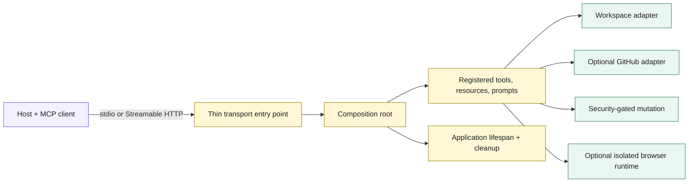

# Repository architecture

This document maps the repository so you can navigate it quickly. The protocol
path targets MCP 2026-07-28, and the repository pins the official Python SDK to
`mcp==2.0.0`.

## One server, several boundaries

The active package under `src/build_an_mcp_server/` is the only complete
implementation. `examples/` contains narrow, single-mechanism programs, never a
second copy of the server.



## Runtime components

- **Configuration** (`config.py`) — `ServerSettings` validates the full policy
  before the server starts. Insecure or incomplete combinations (for example,
  an enabled workspace without roots, or a non-loopback HTTP host) fail at load
  time rather than at request time.
- **Composition root** (`factory.py`) — `create_server` builds one `MCPServer`
  and registers only the capabilities the settings enable. It also installs the
  protocol guard and wires the application lifespan.
- **Thin transports** (`server.py`, `http_server.py`) — small entry points that
  load settings and run the composed server over stdio or Streamable HTTP.
  `http_server.py` also attaches the application-owned scope policy when
  authenticated HTTP is configured.
- **Capabilities**
  - `workspace_capabilities.py` registers the read-only workspace tools, the
    `workspace://manifest` resource, and the review prompt, plus the optional
    workspace write.
  - `github_capabilities.py` registers the optional read-only GitHub tools.
  - `browser_capabilities.py` registers the optional browser tools.
- **Adapters and runtime**
  - `workspace.py` (`WorkspaceAdapter`) performs bounded, path-checked
    filesystem I/O behind opaque root identifiers.
  - `github_adapter.py` reads bounded, provider-independent GitHub context.
  - `browser_runtime.py` owns isolated browser contexts addressed by opaque
    handles.
  - `runtime_state.py` holds application state and the ordered cleanup that runs
    during shutdown.
  - `http_policy.py` applies application-owned scope checks to HTTP requests.
- **Models** (`models.py`) — the stable, structured result types returned by the
  tools and resource.
- **Protocol policy** (`protocol_policy.py`) — a middleware guard that maps an
  unknown `tools/call` name to a top-level JSON-RPC `-32602` invalid-parameters
  error before SDK dispatch.

## Proof directories

```text
tests/
├── unit/          # configuration, adapters, models, runtime state
├── contract/      # in-process MCP surface and behavior
├── runtime/       # real stdio and Streamable HTTP seams
├── security/      # negative controls and redaction
└── integration/   # explicitly gated GitHub/browser/live-host checks
```

This split is deliberate. A passing in-process contract test does not prove
process startup, and a manual host check does not replace a deterministic
contract assertion. Source and tests are the executable source of truth for the
repository's behavior.

## Companion book navigation

The book builds this server progressively; chapter references in the code and
examples (for example, the Chapter 2 workspace example or the Chapter 3 raw
stdio trace) point to where a mechanism is introduced. They are navigation aids,
not separate implementations.
